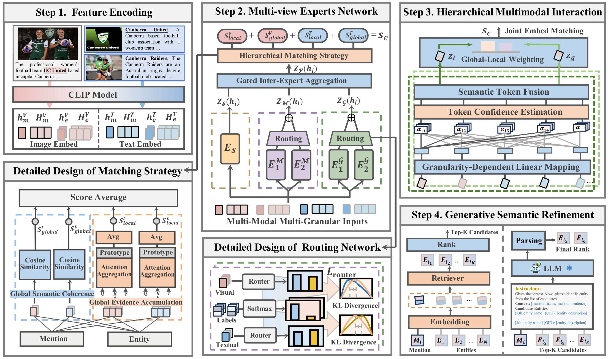

# MECI: Multi-Element Collaborative Interaction for Multimodal Entity Linking

<div align="center">

[](https://www.python.org/)
[](https://pytorch.org/)
[](https://huggingface.co/docs/transformers/index)
[](LICENSE)

</div>

## 📖 Introduction

Multimodal Entity Linking (MEL) aims to disambiguate mentions in multimodal contexts by grounding them to specific entities in a knowledge base. A pivotal challenge in MEL is capturing multi-level correspondences: the semantic consistency between mention-entity pairs and the complementary correlations across modalities. However, existing methods often suffer from element dominance due to their reliance on coupled interactions or coarse global aggregations. In response, we propose the \textbf{M}ulti-\textbf{E}lement \textbf{C}ollaborative \textbf{I}nteraction (\textbf{MECI}) framework. First, to capture multi-element mention-entity correspondences, we develop a Multi-view Experts Network that leverages a “divide-and-conquer” strategy for decoupled feature learning to mitigate element dominance, supported by a KL-guided routing mechanism that governs expert specialization and collaboration. Furthermore, to model cross-modal complementary correlations, we propose a Hierarchical Multimodal Interaction Module, where a dynamic modality-aware weighting network refines interactions across hierarchical semantic levels, thereby integrating multi-granular evidence to counteract element dominance. Finally, we incorporate a generative semantic refinement stage that utilizes large language models for zero-shot re-ranking. Extensive experiments on WikiDiverse, RichpediaMEL, and WikiMEL show that MECI consistently outperforms state-of-the-art baselines, improving Hits@1 by 1.95\%, 7.30\%, and 2.31\%, respectively.
<div align="center">
  
  <br>
  <em>Figure 1: The overall architecture of the proposed MECI framework.</em>
</div>

## 📂 Project Structure

```text
MEL-MECI-main
├── codes/               # Core source codes and model implementations
├── config/              # Configuration files (hyperparameters, paths)
├── resource/            # Auxiliary resources
├── main.py              # Main entry point for training and testing
├── run.sh               # Shell script for one-click execution
└── README.md            # Project documentation
```

## **🛠️ Environment Setup**

Please follow the steps below to set up the environment. We recommend using conda to manage dependencies and avoid version conflicts.

### **1. Create Conda Environment**

```bash
conda create -n meci python=3.7 -y
conda activate meci
```

### **2. Install Dependencies**

Install the required packages using pip. We specify the CUDA version (cu113) to ensure compatibility with the provided PyTorch version.

```bash
# Core Frameworks: Install PyTorch with CUDA 11.3 support
pip install torch==1.11.0+cu113 --extra-index-url [https://download.pytorch.org/whl/cu113](https://download.pytorch.org/whl/cu113)
pip install pytorch-lightning==1.7.7 torchmetrics==0.11.0

# NLP & Vision Libraries
pip install transformers==4.27.1 tokenizers==0.12.1
pip install pillow==9.3.0

# Utilities
pip install omegaconf==2.2.3
```

## **🚀 Data Preparation**

To reproduce the experimental results, please prepare the datasets following these steps:

1. Source Datasets:  
   Acquire the base datasets referenced in the [MIMIC](https://github.com/pengfei-luo/MIMIC) repository.  
2. Enriched Metadata:  
   Download the dataset extensions (containing WikiData description information) from Google Drive.  
3. **Organization:**  
   * Create a root directory named ./data in the project root.  
   * Move the downloaded WikiData descriptions into the corresponding MIMIC dataset folders within ./data.  
4. Pre-trained Weights:  
   Download the specific pre-trained weights for the visual encoder:  
   * Model: [openai/clip-vit-base-patch32](https://huggingface.co/openai/clip-vit-base-patch32)  
   * *Note: Ensure the path to the weights is correctly set in the config/ files or placed in the default cache directory.*

## **⚡ Quick Start**

We provide a shell script to simplify the training process. The script handles configuration loading and initiates the training loop.

```bash
# Grant execution permission (if needed)
chmod +x run.sh

# Start training
sh run.sh
```

**Tip:** You can modify hyperparameters (e.g., batch size, learning rate, epoch) in the config/ directory or directly pass arguments in run.sh to experiment with different settings.

## **🤝 Acknowledgement**

We appreciate the open-source contributions from the community. This code builds upon or refers to the following excellent repositories:

* [MIMIC](https://github.com/pengfei-luo/MIMIC)  
* [MMOE](https://github.com/zhiweihu1103/MEL-MMoE)  
* [UniMEL](https://github.com/Javkonline/UniMEL/tree/main)


## 📄 Citation

If you find this work useful for your research, please cite our paper:

```bibtex
@inproceedings{10.1145/3805712.3809583,
  author       = {Peng Jie, Yongxue Shan, Yongfu Zha, Xiaodong Wang},
  title        = {MECI: Multi-Element Collaborative Interaction for Multimodal Entity Linking},
  booktitle    = {Proceedings of the 49th International ACM SIGIR Conference on Research and Development in Information Retrieval (SIGIR '26)},
  year         = {2026},
  month        = {July},
  address      = {Melbourne, VIC, Australia},
  publisher    = {ACM},
  doi          = {10.1145/3805712.3809583},
  location     = {Melbourne, VIC, Australia}
}
